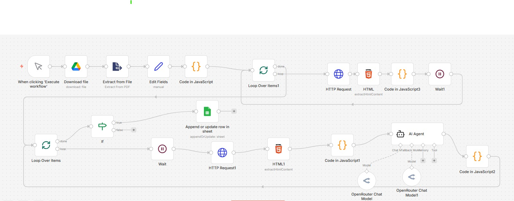

# Job Hunter — AI-Powered Job Matching Pipeline


An end-to-end automation workflow that scrapes job listings, evaluates each one against my CV using an AI agent, scores the match, and logs the best opportunities to a tracker — automatically, with no manual effort.

Built on self-hosted n8n running locally on Windows.

---

## The Problem

Manually browsing job boards is time-consuming and inconsistent. Most listings get skimmed or missed entirely. There's no easy way to know at a glance whether a job is worth applying to without reading the full description.

## The Solution

This workflow runs on demand and handles the entire process automatically — from scraping listings to AI-scored match results logged in a structured Google Sheets tracker, ready to act on.

---

## How It Works

```
Trigger → Download CV → Generate page URLs → Loop through pages
→ Scrape each job listing → Clean & extract data
→ AI agent scores job vs CV → Filter by score
→ Log matches to Google Sheets
```

### Step by step

1. **Trigger** — manually executed on demand (can be switched to a schedule)
2. **Download CV** — fetches the latest CV PDF directly from Google Drive
3. **Extract CV text** — parses the PDF and extracts raw text for AI processing
4. **Generate URLs** — creates a list of 10 paginated job board URLs to scrape
5. **Loop through pages** — iterates through each page with rate limiting to avoid blocks
6. **Scrape job listings** — extracts job titles and URLs from each page using CSS selectors
7. **Fetch full job details** — visits each job URL and extracts title, company, location, salary, experience, deadline, and full description
8. **Clean the data** — custom JavaScript node strips noise, normalises formatting, and structures the data
9. **AI matching** — sends each job + CV text to an AI agent via OpenRouter for evaluation
10. **Score & classify** — AI returns a match score (1–10), suitability flag, application type, and contact email if present
11. **Filter** — only jobs scoring above 5 proceed to logging
12. **Log to Google Sheets** — appends or updates rows in a structured tracker using Job URL as the unique key

---

## AI Model Routing

Uses OpenRouter to dynamically route between two models:

| Model | Role |
|-------|------|
| minimax/minimax-m2.5 | Primary — handles job matching and scoring |
| qwen/qwen3-4b | Fallback — activates automatically if primary fails |

This setup keeps costs low while maintaining reliability. Free or low-cost models are used since the task is structured and repetitive.

---

## AI Scoring System

The AI agent evaluates each job against the CV and returns a structured JSON response:

| Score | Meaning |
|-------|---------|
| 1–3 | Poor match, missing key requirements |
| 4–6 | Partial match, some relevant experience |
| 7–8 | Good match, most requirements met |
| 9–10 | Excellent match, near perfect fit |

Jobs scoring 7 and above are automatically flagged with status **"Applying"**.

---

## Output — Google Sheets Tracker

Every matched job is logged with the following fields:

| Field | Description |
|-------|-------------|
| Job Title | Cleaned job title |
| Company | Extracted company name |
| Location | Cleaned location string |
| Experience | Required experience level |
| Salary | Salary range if listed |
| Deadline | Application deadline |
| Job URL | Direct link to the listing |
| AI Score | Match score out of 10 |
| AI Reason | One-sentence explanation of the score |
| Suitable | True / False |
| Application Type | Email / Form / Manual / Unknown |
| Contact Email | Extracted email address if present |
| Status | New / Applying |
| Date Found | Date the workflow ran |
| Cover Letter URL | Added manually after generation |
| CV URL | Added manually after tailoring |
| Applied Date | Updated manually after applying |
| Notes | Free text notes |

---

## Tech Stack

- **n8n** — self-hosted workflow automation engine
- **OpenRouter** — AI model access and routing
- **Google Drive** — CV storage and retrieval
- **Google Sheets** — job match tracker with deduplication
- **JavaScript** — custom data cleaning and transformation nodes
- **HTTP Request nodes** — web scraping with User-Agent spoofing
- **HTML nodes** — CSS selector-based content extraction

---

## Setup Instructions

1. Import `Mambo_Job_Hunter_Clean.json` into your n8n instance
2. Connect your credentials:
   - Google Drive OAuth2
   - Google Sheets OAuth2
   - OpenRouter API
3. Update the **Google Drive node** to point to your CV file
4. Update the **Google Sheets node** to point to your tracker spreadsheet
5. Adjust the job board URL in the Code node if scraping a different site
6. Execute manually or add a Schedule Trigger node to run daily

---

## Notes

- All credentials are stored in n8n and are not included in the exported JSON
- Rate limiting (Wait nodes) is built in to avoid IP blocks from the job board
- The workflow deduplicates by Job URL so running it multiple times won't create duplicate rows
- CSS selectors may need updating if the job board changes its HTML structure

---

*Part of the [n8n Automation Workflows](../) collection by Jeremiah Mutinda*
